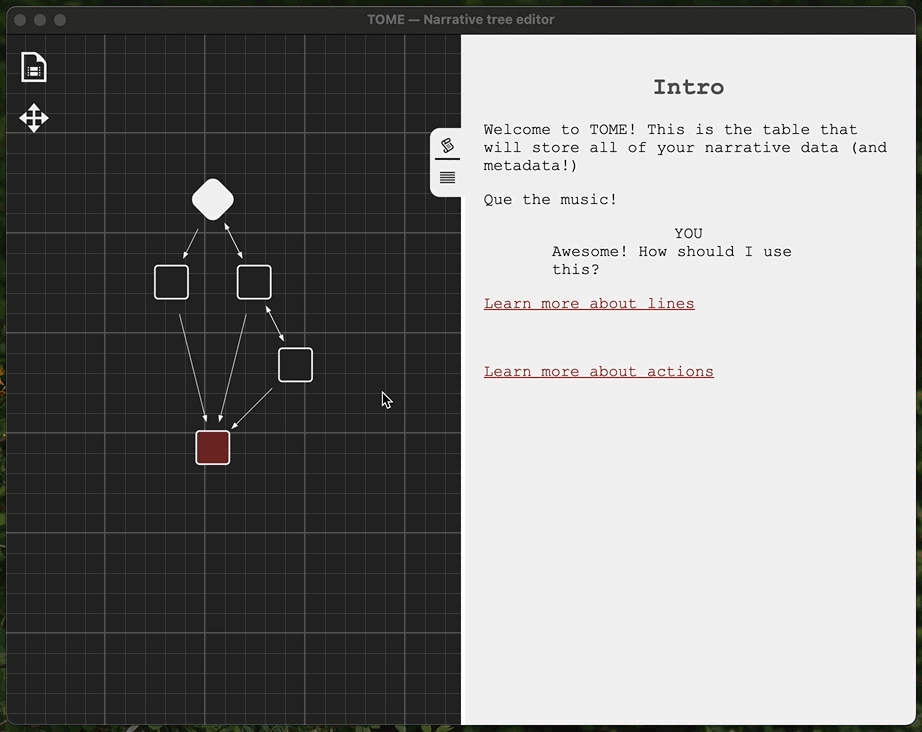

# 🌳 tome : narrative tree editor 🌳

TOME is an editor for dialogue and story trees that allows you to plan your entire game in one place. 
This format allows you to design the tree, write all of the character lines, notate actions and commands and store any additional data you might need for your game: scenes, backgrounds, visuals, music cues.

## Editor

- **Automatic tree building** : Just write your story! No need to move blocks, editor will do its best to keep your diagram clean, readable and beautiful. Color code your blocks to make the tree even easier to understand :christmas_tree:
- **Script editing** : Feel like a professional script writer with script-styled editor. Easily add and remove lines, assign characters, set line actions or add narration;
- **Table editting** : Jump into the table mode to review your story data, set meta keys like music and visual cues;
- **Projects** : Sometimes one tree isn't enough — instead of working with individual files TOME opens project folders and allows you to switch between multiple trees;
- **Work anywhere** : Editor is built using Electron, which means that you will be able to run it on your Mac, Windows or Linux machine. And maybe eventually online...
- **Autosave** : Don't worry about losing your progress, it's being saved after every change you make

## TOME Format

Have you ever felt anxious about the state of your hobby project after long holidays or busy day-job months? Coming back to a project not being sure it's even going to compile, let alone play the right music for the right scene? This is the reason we (me and my wife) have designed the tome story format — as long as everything about your game is in just one place, it's way easier to keep track and feel confident about the state of your game.

It's essentially a spreadsheet, the easiest of all formats. It's so simple you don't even need the editor, you can write your entire game using Google Spreadsheets (which we have done).  [Here is an example of what it looks like](https://docs.google.com/spreadsheets/d/1_-pYQTF3__aO8ktGBoTXIJRwPD7H56V2t4YUsSewUGw/edit?usp=sharing). 

Editor works with .tsv files that you can export and import in any spreadsheet editor of your choosing. Must-have columns are: 
| Scene | Character | Text | Actions | Conditions |
| ----- | --------- | ---- | ------- | ---------- |
| -     | -         | -    | -       | -          |

Everything else is considered to be Meta data that you can add or delete based on your needs.

## Integrations

After you've finished working on your story it would be nice to actually start making a game with it. The format is simple enough that you can parse it with any .tsv parser, alternatively there's an export to JSON option that will provide you a file that's ready to be deserialised in your game.

For a more thorough integration that would run your story in one of the popular game engines... That would take a lot of time but it's possible! Who knows, maybe you can write one and share it with the class.

- **Unity Integration** is WIP, but I'll publish it eventually;

## Downloads 

WIP... 